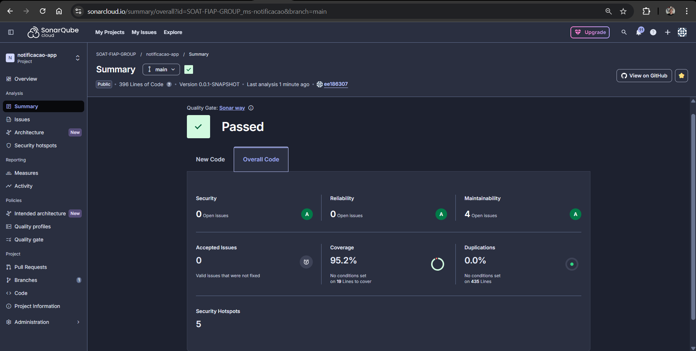

# Tech Challenge - Fase 5 | Hackaton

---

## Integrantes do grupo:

- Jose Augusto dos Santos- RM 361650
- Nathalia Matielo Rodrigues- RM 363100
- Rogerio Inacio Silva Junior- RM 364104
- Vanessa Moreira Wendling - RM 362741

---

## 📦 Evidência da cobertura de testes SonarCloud



---

## 📦 Funcionalidades Entregues na Fase 5

- Criação do microsserviço de notificação em caso de falhas
- Implementação do banco de dados NoSql DynamoDb para registro dos ocorridos
- Envio de comunicado via email para o usuário
- Comunicação via mensageria via AWS SQS
- Cobertura de testes superior a 80% (Segue evidência) 
- Branches Main/Master protegidas
- Deploy automatizado via CI/CD
---

## 💡 Solução Proposta

O microserviço faz parte da arquitetura de solução desenvolvida referente a um sistema 
de processamento de vídeos onde o usuário realiza seu cadastro na plataforma, realiza o upload de um vídeo e 
recebe um zip contendo frames do vídeo enviado 
O sistema em questão foi desenvolvido para a finalidade de notificar o usuário em caso de falha no 
processamento de um de seus vídeos.


---

### Requisitos contemplados

- Escalabilidade e alta disponibilidade com Kubernetes.
- Segurança e gerenciamento de configuração via Secrets e ConfigMaps.
- Visibilidade e controle total via painel administrativo.
- Notificação do usuário
- Comunicação via mensageria
- Qualidade de software
- Persistência dos dados
- CI/CD

---


## 🏛️ Arquitetura


#### [Clique aqui e acesse o link para o Miro do projeto:](https://miro.com/welcomeonboard/QUhYQ29aTjV2ZThVcnh5YjNrWWI3QzB4UzVhTEVUYmZ5SldxdTRIWDRwWW9NZ0Zrbi9sVjBmOXFVM0ZkU0RhSFkyMjltazM4TU8wNStIUy9JMDJQYVZEa2xrNkJZZzN2SU1vang4L2NGcjVhbXViWDZ0S0YxeTBZOVozUU05a2hBS2NFMDFkcUNFSnM0d3FEN050ekl3PT0hdjE=?share_link_id=629025436695)


## 🎥 Vídeo Demonstrativo

Assista ao vídeo com demonstração do funcionamento da aplicação e da arquitetura: https://youtu.be/aFvZ-5U6PtE 


---

## ⚙️ Tecnologias Utilizadas

- Java 17
- Spring Boot
- Kubernetes 
- DynamoDb
- SQS
- Terraform
- Github Actions

---

## 🚀 Como Executar Localmente

1. Instale JDK 17 e Maven.
2. Clone o repositório:
    ```bash
    git clone https://github.com/SOAT-FIAP-GROUP/SOAT_Pagamentos.git
    cd SOAT_Pagamentos
    ```
3. Crie o banco de dados DynamoDB via terraform
   
4. Execute a aplicação via Maven:
    ```bash
    mvn spring-boot:run
    ```
## 🚀 Como Executar via Kubernetes
1. Instalar Kubernetes com Minikube, ou
2. Instalar Docker Desktop e ativar Kubernetes
    - Se estiver usando **Minikube** habilite o metrics-server (necessário para HPA funcionar):
    ```bash
    minikube addons enable metrics-server
    ```
    - Aplique os manifetos YAML:
    ```bash
    kubectl apply -f k8s/
    ```
    - Endpoints para Health Checks:
        - Liveness Probe:
      ```bash
      /actuator/health/liveness
      ```
        - Readiness Probe:
      ```bash
      /actuator/health/readiness
      ```

---

## 📚 Exemplo de Request

*OBS.: O serviço implementa apenas comunicação via mensageria*

### Payload da mensagem a ser enviada:

```
{
	"processamentoId": "2c5e0dcd-3688-40f8-afd4-0dc596f12087",
  	"username": "Jose Augusto",
  	"email": "a@b.com",
  	"userId": "00fce457-2fdc-47c2-b219-0659ecfe56b0"
  	"dataNotificacao": "2026-02-27T18:56:41"
}
```
processamentoId: UUID gerado pelo serviço de processamento
username: nome do usuário cadastrado
email: email do usuário a receber a notificação
userId: Id do usuário no AWS Cognito gerado automaticamente
dataNotificacao: timestamp da hora do ocorrido
